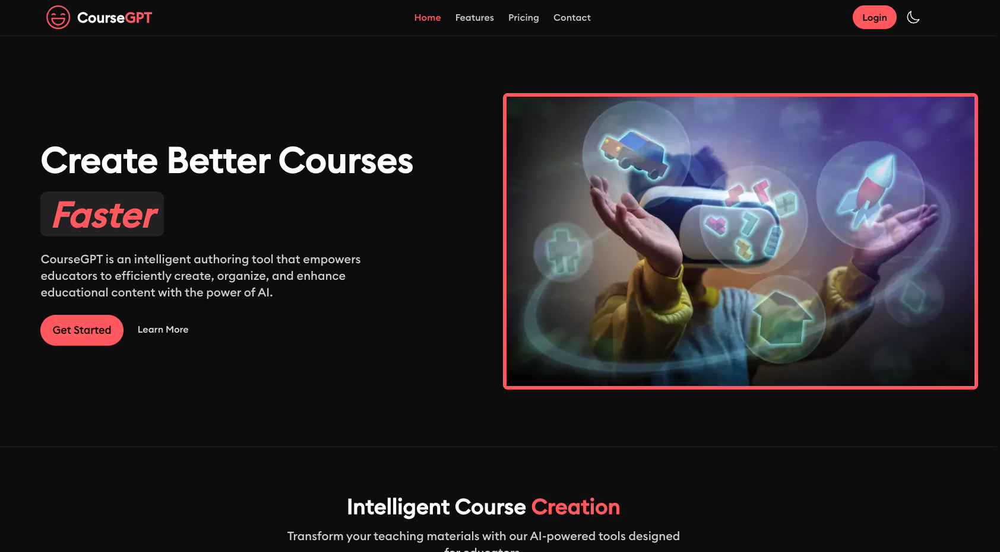
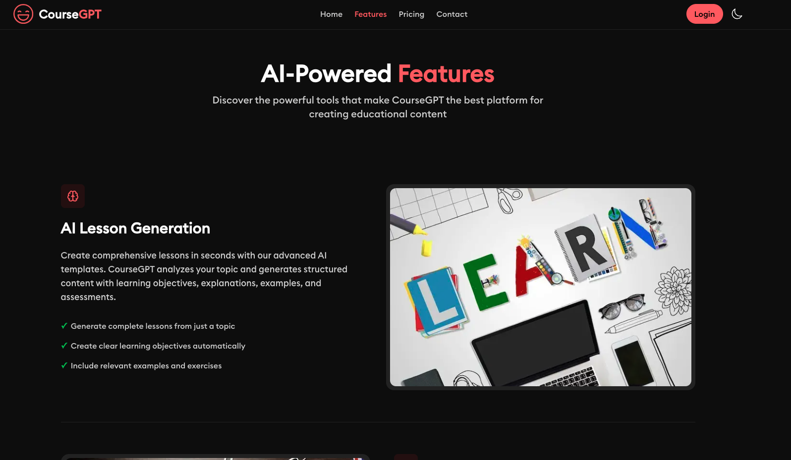
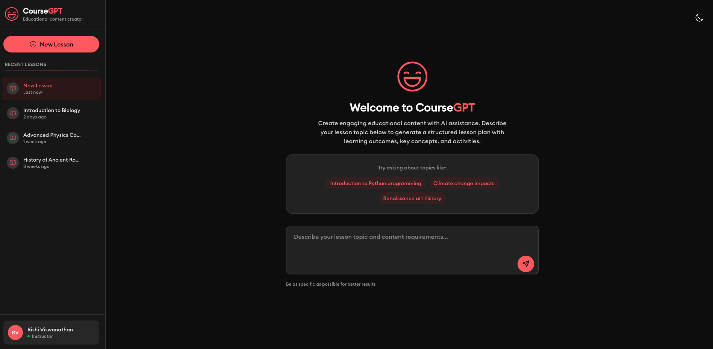
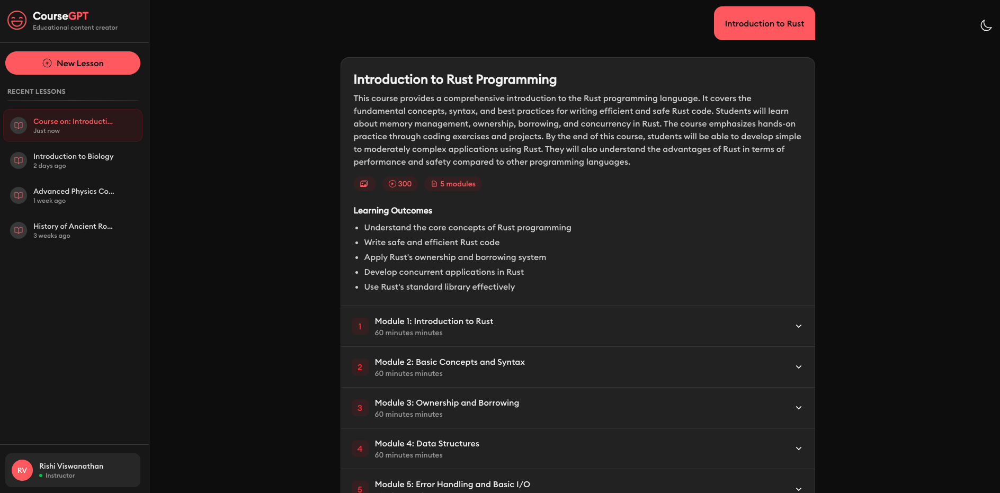

# CourseGPT

  

  
**An intelligent authoring tool empowering educators and content creators**

## Overview

CourseGPT is an intelligent authoring tool that empowers educators and content
creators to efficiently create, organize, and enhance educational content.
(Task for [Kalvium](https://kalvium.com/))

## Key Features

1. **AI-Powered Course Generation**
   - Generate comprehensive courses from simple prompts
   - Intelligent content organization and structuring
   - Auto-create quizzes and learning assessments

2. **Multi-Format Export Options**
   - Export courses to PowerPoint presentations
   - Generate Word documents with professional formatting
   - Create printable PDF materials for students

3. **Smart Content Enhancement**
   - AI-driven content recommendations
   - Grammar and readability improvements
   - Interactive elements for better engagement

## Screenshots

View Application Screenshots

### Home

### Features

### Auth

### Dashboard

### Results

## Technology Stack

- **Frontend**: Next.js
- **Backend**: Hono.js
- **AI**: Google Gemini
- **Deployment**: Vercel

## Demo

See CourseGPT in action: [Watch Demo Video](https://www.youtube.com/watch?v=wuFMhsSdimo)

## License

[MIT](./LICENSE)

---
